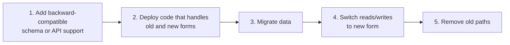

# Rollout and Production Risk

Some agent-assisted changes are safe after tests and review. Others need rollout planning because they can affect production behavior, data, customers, or operations.

## Production-Risk Changes

Treat these as production-risk changes:

- auth or authorization changes
- database migrations
- API contract changes
- background jobs and queues
- billing, payments, or entitlements
- permissions and roles
- feature flags and experiments
- infrastructure, CI/CD, or deployment changes
- data backfills or repair scripts
- observability and alerting changes

## Rollout Checklist

Before merging or deploying production-risk changes, identify:

- accountable release owner
- affected users or systems
- feature flag or staged rollout plan
- migration order
- backward compatibility requirements
- monitoring signals
- rollback path
- support or incident response owner

## Feature Flags

Use feature flags when a change benefits from staged exposure or fast rollback.

Good candidates:

- new user-facing workflows
- risky backend behavior changes
- performance-sensitive paths
- changes with uncertain UX or adoption impact
- changes that may need fast disablement without redeploying

Do not use flags as a substitute for tests, review, or clear ownership.

## Migrations

Database and API migrations need sequencing.

Prefer expand-and-contract patterns:

1. add backward-compatible schema or API support
2. deploy code that can use old and new forms
3. migrate data
4. switch reads/writes
5. remove old paths later

Agents can draft migration plans, but humans should approve order, rollback, and production impact.

## Observability

For production-risk changes, consider whether the PR should add or update:

- logs
- metrics
- traces
- dashboards
- alerts
- runbooks

Do not add noisy logging or alerts just because an agent touched the area. Add observability when it helps detect or diagnose real failure modes.

## Rollback

Rollback plans should answer:

- can this be reverted safely?
- does rollback require data migration?
- does rollback require disabling a feature flag?
- will old and new versions coexist during deploy?
- who decides whether to roll back?

If rollback is hard, call that out in the PR.
